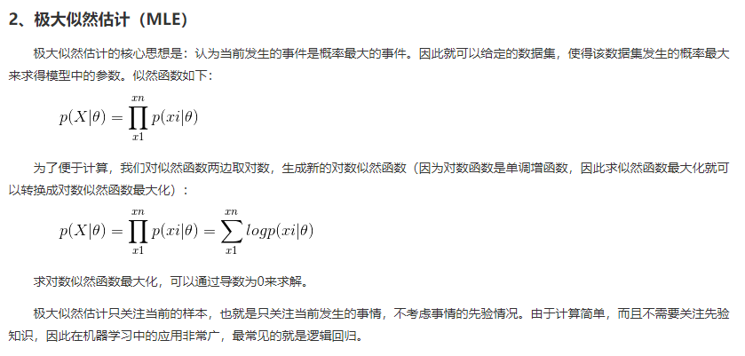
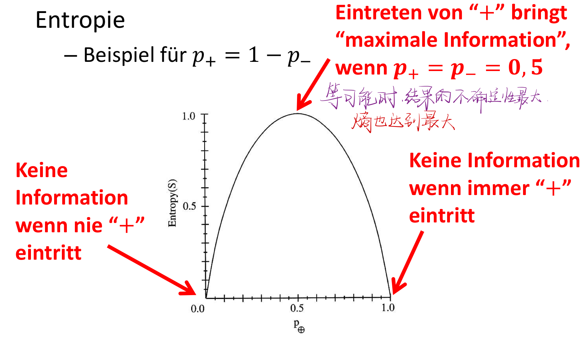
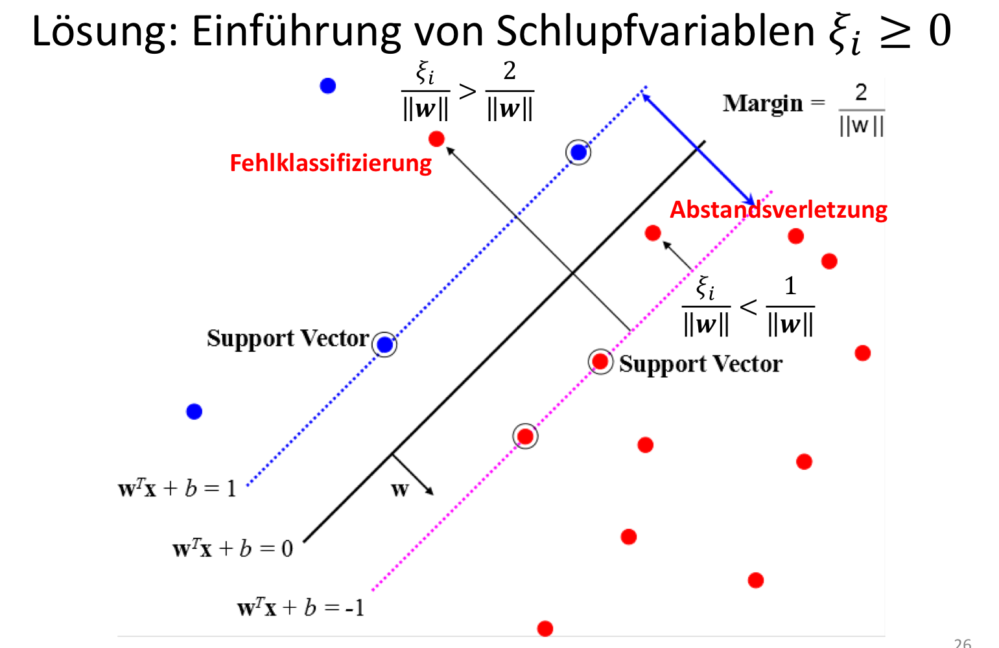

# Künstliche Intelligenz \>\>

## Suchen \>\>

### Uninformiert Suchen \>\>

#### 1.Problemformulierung [\>\>](marginnote3app://note/6FA8706B-481C-4B98-AE3F-A7DBB5A3997B)

  
  
  
  
  
  

#### Suchbaum \>\>

Datenstruktur: Suchbaum – Enthält Knoten / Kanten 包含结点和边 – Repräsentiert eine Zustandsfolge, d.h. Knoten des Suchbaumes sind keine Zustände (sondern enthalten einen Zustand – zwei Knoten können den selben Zustand enthalten) – Informationen im Knoten • Elternknoten • Zustandsübergang • Zustand • Kosten des Pfades bis zum Knoten • Tiefe des Knotens im Suchbaum  
  
  
  

#### Breitensuche(FIFO) 广度优先搜索 \>\>

– Die Blätter des Suchbaumes werden in einer FIFO (first-in-first-out)-Datenstruktur gespeichert BFS遵循着FIFO规则，是因为当一个结点找到其子结点时，可能子结点有多个，那么先对其子结点加入队列，然后优先处理每一个子结点，子结点处理完之后，其子结点的子结点会加入到队伍中，但是是后加入队列的，排在队伍的最后。既所有的先加入子结点都在队伍的前沿，所以FIFO要先处理前沿的结点 – Beginnend mit dem Wurzelknoten werden jeweils alle Nachfolger eines Knoten bestimmt und in 𝐿 gespeichert – Wegen FIFO kommen die Kinder immer nach der Elterngeneration dran, d.h. • Es werden erst alle Knoten mit Tiefe 𝑘 betrachtet, danach alle Knoten mit Tiefe 𝑘 + 1, usw. • Es findet eine Suche „in die Breite“ statt

#### Tiefensuche 深度优先搜索 \>\>

– Die Blätter des Suchbaumes werden in einer LIFO (last-in-first-out)-Datenstruktur gespeichert DFS遵循着LIFO规则，是因为当一个结点找到其多个子结点时，将所有子结点加入到队列中，然后优先处理最后进来的节点，最后的子结点处理完毕后，会将这个子结点的子结点加入队列，所以新加入的子结点的子结点还是在队伍的最后，根据LIFO会继续优先处理最后加入的结点。 – Beginnend mit dem Wurzelknoten wird sukzessive zu einem Knoten ein Nachfolger (Kind) ausgewählt – Wegen LIFO wird zuerst ein Pfad bis zum Blatt verfolgt, d.h. • Es wird immer der Knoten mit der größten Tiefe weiter expandiert – Wegen LIFO wird zuerst ein Pfad bis zum Blatt verfolgt, d.h. • Erst wenn bei einem Knoten der Tiefe 𝑘 keine unbetrachteten Nachfolger mehr existieren, wird der nächste „Geschwisterknoten“ derselben Tiefe betrachtet bzw. ein Knoten mit geringerer Tiefe betrachtet • Es findet eine Suche „in die Tiefe“ statt – Alternativ zur Verwaltung aller Kinder im Stack: Backtracking vom Kind zum Elternknoten, an dem dann der nächste Kindknoten gewählt wird

##### Iterativ fortschreitende Tiefensuche 迭代深度优先搜索 \>\>

– Tiefensuche mit Tiefenlimit 𝑑max – Falls eine Lösung gefunden wurde, terminiere mit Lösung – Sonst: • Falls der Suchbaum nicht vollständig durchlaufen wurde, inkrementiere 𝑑max um 1 und starte einen neuen Suchlauf • Sonst terminiere mit dem Ergebnis, dass keine Lösung existiert – Die Suche wird also unter Umständen sehr oft wiederholt?! • Ja, aber die meisten Knoten haben immer die Tiefe des Lösungsknoten • Es werden nur Knoten mit maximal der Tiefe des Lösungsknoten erzeugt – vergleiche Breitensuche, dort werden für einen Teil der Knoten mit Tiefe 𝑘 die Kindknoten erzeugt und in der FIFO-Schlange gespeichert • Daher ist iterative Tiefensuche ggf. effizienter als Breitensuche!  
是深度优先搜索，但是与普通深度优先搜索不同的是，每次深搜都有搜索的限度，是对当前限度下的搜索树进行深度优先搜索，限度之外部分不做考虑。如果没有找到解，那么久增大深度，再进行深搜，如此循环直到找到解为止。

#### Bidirektionale Suche 双向搜索 \>\>

– Suche sowohl vom Startzustand Richtung Zielzustand als auch vom Zielzustand Richtung Startzustand – Reduziert die Suchtiefe und damit die Zeit – Aber • Oft existieren mehrere Zielzustände (Schach-Matt- Positionen) • Die Vorgängerzustände lassen sich oft nicht einfach berechnen

#### Kostenbasierte Suche: UCS 统一代价搜索算法 \>\>

– Ähnlich wie Breitensuche, aber statt der Tiefe wird anhand einer Kostenfunktion bestimmt, welche Nachfolger gewählt werden sollen (sortierte Liste) – Es wird der Knoten expandiert, für den die Kosten von der Wurzel zum Knoten am geringsten sind – Für Kosten von 1 für alle Zustandsübergänge ergibt sich der gleiche Ablauf wie für Breitensuche – Zählt zu UNINFORMIERTER Suche, aber schöne Motivation für die nächsten Algorithmen  
UCS算法有三个数据结构: frontier: 存储到达当前定点需要的花费cost，这里的cost是目前到达这个点最小的cost，如果之后有到达这个点更小的cost，则更新这个点。 explored: 存放目前已经探索过的点   
2\. 算法流程 (1）将起始点加入到frontier中，将与frontier相连的点进行探索，每个点的代价（后面用cost替代）是从起点到该点的距离，然后将所有的点加入到frontier里面 (2) 从frontier里面挑出cost最小的点A，判断该点是不是终点，如果是终点算法结束。如果不是终点，探索与该点相连的所有点，每个点的cost是A点的cost加上A点到B点的路径的权重。如果B点是已经出现在frontier里面了，比较一下原来的cost与新生成的cost哪个更小，然后将最小的cost赋值给B点，并更新它的父节点。 (3) 如果frontier为空还没有找到终点，则没有到达终点的最短路径

#### Kriterien zur Bewertung von Lösungsstrategien \>\>

### Informiert Suchen \>\>

#### Greedy Best First Search 贪心最佳优先算法 \>\>

– Der jeweils bzgl. einer Bewertungsfunktion 𝑓 𝑛 beste Knoten in der fringe wird expandiert (⇒ fringe 𝐿 ist eine Prioritätswarteschlange) – Bewertungsfunktion 𝑓 𝑛 setzt sich aus Heuristik h 𝑛 und bekannten Kosten 𝑔 𝑛 zusammen – h 𝑛 sind die geschätzten Kosten von 𝑛 zum Ziel – 𝑔 𝑛 sind die bekannten Kosten vom Start zu 𝑛  
所谓贪婪，既只扩展当前代价最小的节点，或是说离当前节点最近的点。 当前的代价小，但之后的代价不一定小，如果最优解在代价最大的点，那么按照贪心最佳优先算法，可能找不到这个解，然后陷入死循环。

#### A\*Search A\*搜索 \>\>

Kombiniert bereits entstandene Kosten mit heuristischer Abschätzung der verbleibenden Kosten 把基于花费的算法和启发式算法相结合 – Bedingung(en) an die Heuristik • Zulässig (optimistisch, nie überschätzend): 𝑐𝑛,𝑧 ≥h𝑛, mit 𝑐 𝑛, 𝑧 kürzester Weg von 𝑛 zum Ziel 𝑧 • Konsistent (aufsteigende 𝑓-Werte für jeden Pfad): h𝑛 ≤𝑐𝑛,𝑛′ +h𝑛′ , für 𝑛′ Nachfolger von 𝑛 – Sei 𝑧 ein Zielknoten im Suchbaum, 𝑧∗ der optimale Zielknoten (⇒ h 𝑧∗ = 0) und 𝑛 ein Knoten auf dem optimalen Pfad zum Ziel 𝑧∗ – Können wir ein anderes 𝑧 vor 𝑧∗ finden? Es gilt: 𝑓𝑛 =𝑔𝑛 +h𝑛 ≤𝑔𝑛 +𝑐𝑛,𝑧∗ =𝑔𝑧∗ =𝑓𝑧∗ ≤𝑓𝑧  
可以理解为每一步寻找的下一个结点是 和原点出发当前路径的距离之和加上与目标点的距离 最小的点。 每次寻找点 都需要思考三个步骤。 1.下一个结点是否能有更少的花费(UCS算法) 2.下一个结点是否是距离目标点最近(GBFS算法) 3.花费和距离目标点的距离相加，是否是最小的

#### Heuristken 启发式算法 \>\>

启发式算法相对于最优化算法, 最优算法求得这个问题的实例的最优解。 启发式算法在基于直观或经验下，在可接受的花费内，给出待解决组合优化问题的每一个实例的可行解，该可行解和最优解的偏离程度不能被预估。

### Lokal Suche und Optimierung 局部搜索 \>\>

Bisher – Uninformierte Suche nach „einer Lösung“ 无信息搜素一个解 – Uninformierte Suche nach „der besten Lösung“ 无信息搜索一个最优解 – Suche nach der besten Lösung unter Verwendung von Heuristiken 通过启发式算法找一个最优解 Problem – Der Suchraum ist oft sehr groß 搜索空间太大 – Die Suche nach der optimalen Lösung kann sehr lange dauern 一个优化解的时间很久 – Die Suche nach der optimalen Lösung kann am Platzbedarf scheitern Idee: – Suchverfahren nutzen, die möglichst effizient eine möglichst gute – die optimale? – Lösung finden – Der Weg zur Lösung ist oft nicht von Interesse, es ist ausreichend, einen Zielzustand zu finden  
达到目的路径不会被储存，而是当前的状态，总在去找更好的状态。  
• Der Pfad bzw. der bereits betrachtete Teil des Suchraumes werden nicht gespeichert (Problem?) 搜索空间中被探究过的部分不会被保存 • Vorteile: Sehr wenig (meistens konstanter) Speicherbedarf, Finden von guten Lösungen auch in großen (unendlichen?) Zustandsräumen 需要很少的储存空间 • Generalisierung: Optimierungsprobleme, Finden eines optimalen Zustands anhand einer Zielfunktion (objective function) 𝑓 寻找优化状态取决于目标函数  
在优化的范围称为目标函数，变化目标函数的变量和参数，得到不同的状态。不同的状态的函数值组成了一个连续的目标函数，而最优解问题则是寻找这个函数的极值，这个极值的状态又对应了参数与变量。  
  
  
  
  
• Diskrete Algorithmen bestimmen nur die Richtung (Nachfolger) • Kontinuierliche Algorithmen bestimmen (meist) Richtung und Schrittweite  
• Für HC, SA, GA kann nicht festgestellt werden, ob gefundene Lösung globales Optimum ist HC SA GA 不能确定找到的结果是不是全局最优解 • HC, SA, GA finden ggf. auch in sehr großen Zustandsräumen schnell gute Lösungen HC SA GA适合在非常大的搜索空间里快速找到好的解 • Entscheidend für schnellen Erfolg ist die Dichte der Lösungen im Zustandsraum • “intelligente” Wahl geeigneter Zustands- repräsentationen und Zustandsüberführungs- funktionen kritisch • Parameter oft nur experimentell bestimmbar

#### Hill-Climbing Search (HC) 爬山算法 \>\>

保存每个状态的目标函数值。 并且只向更好状态的方向移动。 问题在于: 会找到局部的最值和最优解。 解决方法 : 1. 随机选择入手点 2. 从不同的开始点入手  
Problem – Hill-Climbing bleibt in lokalen Extrema hängen 爬山算法会局限在局部最值 – Bisher beste Idee: mehrfach mit zufälligen Werten neu starten 解决方案: 随机重启爬山算法 – Lässt sich diese Idee ausbauen?

##### 简易爬山算法 \>\>

步骤1：评估初始状态，如果是目标状态，则返回成功并停止。 步骤2：循环直到找到解决方案或没有新的运算符可供应用。 步骤3：选择并将运算符应用于当前状态。 步骤4：检查新状态： —如果是目标状态，则返回成功并退出。 \#否则，如果它优于当前状态，则将新状态指定为当前状态。 \#否则，如果不比当前状态好，则返回步骤2。 步骤5：退出

##### Steepest Ascent 陡峭爬山算法 \>\>

• wählt immer den Zustand mit der größten Verbesserung (steilstem Anstieg der Zielfunktion 𝑓) als Nachfolgezustand  
Steepest-Ascent爬坡： 最陡峭的Ascent算法是简单爬山算法的变体。该算法检查当前状态的所有相邻节点，并选择最接近目标状态的一个邻居节点。该算法在搜索多个邻居时会消耗更多时间 最速爬坡爬山算法： 步骤1：评估初始状态，如果是目标状态，则返回成功并停止，否则将当前状态作为初始状态。 步骤2：循环直到找到解决方案或当前状态不变。 让SUCC成为一个状态，使得当前状态的任何继承者都会比它更好。 对于适用于当前状态的每个运算符：应用new运算符并生成新状态。 评估新的状态。 \#如果是目标状态，则返回并退出，否则将其与SUCC进行比较。 \#如果它优于SUCC，则将新状态设置为SUCC。 \#如果SUCC优于当前状态，则将当前状态设置为SUCC。 步骤3：退出

##### Stochastik 随机爬山算法 \>\>

• wählt zufällig einen Nachfolgezustand aus, für den der Zielfunktionswert 𝑓 größer ist (Wahrscheinlichkeit kann an den Anstieg gekoppelt sein)  
选择一个点作为初始点，之后在所有目标函数值大于当前函数值的邻点中，随机选择新点。  
问题在于，是局部搜索算法，会陷入局部最优状态。

##### First choice 首选爬山算法 \>\>

• der erste mögliche Nachfolgezustand mit einem besseren Funktionswert 𝑓 wird gewählt (es müssen nicht alle Nachfolgezustände generiert werden!)  
选择一个点作为初始点，之后在所有目标函数值大于当前函数值的邻点中，选择第一个更优的新点位当前状态。  
首选爬山算法是一种特殊的随机爬山算法，爬山算法是在所有的候选者中，随机选择一个。而首选爬山算法中，是在所有候选者中选择第一个。

##### Random-restart 随机重新开始爬山算法 \>\>

• mehrfache Wiederholung mit zufälligem Startzustand – größere Wahrscheinlichkeit, einen Zielfunktionswert nahe am Maximum zu erreichen  
当爬山法执行到局部最优解后，再多次随机寻找初始点，以提高可能性，使目标函数值尽可能达到最大值附近。

#### Simulated Annealing Search (SA) 模拟退火算法 \>\>

Annealing (Hartglühen) – Erhitzen und langsames Abkühlen (tempern, härten) von, z.B. Glas oder Metall – Ziel ist ein weniger brüchiges Material – Annahme: Starke Teilchenbewegung bei hohen Temperaturen, durch langsame Abkühlung Einnahme von festen Gitterpositionen, kristalline Struktur: Zustand minimaler Energie – Die Geschwindigkeit beim Abkühlen hat großen Einfluß darauf, ob sich die Teilchen in einem möglichst regulären Gitter anordnen – Eine solche kristalline Struktur entspricht dem Zustand minimaler Energie des Materials – Zu schnelles Abkühlen bremst die Teilchen- bewegung bevor sie einen Gitterpunkt erreichen können ...  
假设开始状态在A，随着迭代次数更新到B局部最优解，这时发现更新到B时，能量比A要低，则说明接近最优解了，因此百分百转移，状态到达B后，发现下一步能量上升了，如果是梯度下降则是不允许继续向前的，而这里会以一定的概率跳出这个坑，这个概率和当前的状态、能量等都有关系，如果B最终跳出来了到达C，又会继续以一定的概率跳出来，直到到达D后，就会稳定下来。  
  
  
  
  
同样遵循爬山算法，在得到一个初始值后通过爬山算法得到局部最优解。 但是达到最优解后，还有一定几率跳出最优解。 既达到最优解后，重新选择初始点通过爬山算法得到局部解。 但是是否选择这个最优解，则有一定概率选择。 这个概率的大小根据参数决定，而实质上，会对当前状态函数值进行一个测量，越靠近目标函数值，则意味着不选择这个局部最优解的概率越低，也就是会重新选择的概率越高。 形象的讲，就是当他达到一个局部最优解后，意味着温度降到了一个局部极值，这个温度会影响是否选择这个局部最优解的概率，温度越低，则重新选择的概率越低。 当温度低时，如果不选择重新选择，则意味着找到了新的新的点，如果重新选择了，如果找到温度更低的点，则更好，更优化，更稳定。如果说，找到了温度高的点，则更不稳定，会有更大概率更换。 根据公式，表明了p为出现能量差的概率，也就是重新选择的概率。   
  

##### 参数控制问题 [\>\>](marginnote3app://note/585D1E90-FF9B-4F5F-B0F6-C27A45400229)

1\. 温度T的初始值设置。 初始温度高，也就是局部最优解离全局最优解差距大。则搜索到全局最优解的可能性大，但是需要花费大量时间。反之则会节省时间，但是全局搜索的性能收到影响。 从公式上看，会影响每次温度确认是否跳出的概率   
2\. T的衰减函数 衰减函数为Tk+1=a\*Tk 其中k为降温的次数，a是一个常数，为0.5到0.99。通常为了保证大的搜索空间。a接近于1。   
3.退火速度Markov链的长度。 也就是任意一个温度T的迭代次数。会使在控制参数T的每一个取值上达到准平衡。 循环次数的增加必然带来计算开销的增加。  
4.控制参数T的终止值，就是若干个解都没有变化，也就是达到全局最优解，也就是T达到一个值时，不太容易跳出当前区域。因此应为足够小的正数，好让效果最好。约为0.01到5。但这个值不能为0。

##### 模拟退火的要素 [\>\>](marginnote3app://note/12171DE0-D969-49E8-9CA7-742AECCE3A42)

状态空间与状态产生函数 1）搜索空间也称为状态空间，它由经过编码的可行解的集合组成。 2）状态产生函数（邻域函数）应尽可能保证产生的候选解遍布全部解空间。通常由两部分组成，即产生候选解的方式和候选解产生的概率分布。 3）候选解一般采用按照某一概率密度函数对解空间进行随机采样来获得。 4）概率分布可以是均匀分布、正态分布、指数分布等。 状态转移概率 1）状态转移概率是指从一个状态向另一个状态的转移概率。 2）通俗的理解是接受一个新解为当前解的概率。 3）它与当前的温度参数T有关，随温度下降而减小。 4）一般采用Metropolis准则。 内循环终止准则：也称Metropolis抽样稳定准则，用于决定在各温度下产生候选解的数目。常用的抽样稳定准则包括： 1）检验目标函数的均值是否稳定。 2）连续若干步的目标值变化较小。 3）按一定的步数抽样。 外循环终止准则：即算法终止准则，常用的包括： 1）设置终止温度的阈值。 2）设置外循环迭代次数。 3）算法搜索到的最优值连续若干步保持不变。 4）检验系统熵是否稳定。

#### Evolutionäre Algorithmen 进化算法 \>\>

不是一个具体的算法，而是一个算法簇。灵感来自于大自然中的生物进化操作。 Ablauf des Algorithmus – Erzeuge Startpopulation mit 𝑛 Individuen – Berechne Fitness aller Individuen 𝑡𝑖 der aktuellen Population und sortiere absteigend – Wähle die 𝑝 \< 𝑛 besten Individuen aus, entferne die restlichen – Berechne die Wahrscheinlichkeit zur Fortpflanzung z.B. relative Fitness = 𝑓 𝑡 / σ𝑖 𝑓 𝑡𝑖 – Wähle entsprechend der Fortpflanzungswahr- scheinlichkeit Elternzustände aus und erzeuge neue 𝑛 − 𝑝 neue Individuen durch Fortpflanzung – Mutiere 𝑚 ≤ 𝑛 Individuen

##### Genetic Algorithe (GA) 遗传算法 \>\>

Ablauf des Algorithmus – Erzeuge Startpopulation mit 𝑛 Individuen 生成一个有n个个体的种群 （初始化过程） – Berechne Fitness aller Individuen 𝑡𝑖 der aktuellen Population und sortiere absteigend 计算每个个体的适应度，并排序 （确定适应度函数，也就是优秀基因的评价标准） – Wähle die 𝑝 \< 𝑛 besten Individuen aus, entferne die restlichen 从目前种群中找到优秀的个体得以保留，并设置种群最多容纳p个个体 （确定种群最大的容量，并保留更优秀的基因） – Berechne die Wahrscheinlichkeit zur Fortpflanzung z.B. relative Fitness = 𝑓 𝑡 / σ𝑖 𝑓 𝑡𝑖 根据个体的适应度计算出繁殖概率 （得到每个个体的繁殖概率，基因好的，会有更高的繁殖可能，因为好的基因更适合繁衍） – Wähle entsprechend der Fortpflanzungswahr- scheinlichkeit Elternzustände aus und erzeuge neue 𝑛 根据繁殖概率产生01均匀随机数来决定哪个个体参与交配，个体繁殖概率高，则有机会多次参加交配。 （交叉过程，通过染色体交换组合，产生新的个体） − 𝑝 neue Individuen durch Fortpflanzung 最终得到p个新的个体 （交叉算子的交叉方式有多种） – Mutiere 𝑚 ≤ 𝑛 Individuen 其中有大概1/15的概率基因突变

###### 元素 [\>\>](marginnote3app://note/9C5CB554-EF1E-4D3E-AC4A-7F9497C2EE88)

Elemente eines genetischen Algorithmus – Kodierungsvorschrift für Lösungskandidaten 编码规则 – Methode zur Erzeugung einer Anfangspopulation 初始种群的生成方式 – Bewertungsfunktion (Fitnessfunktion) 适应函数 – Auswahlmethode 选择交配的方式 – Abbruchkriterium 终止标准 – Genetische Operatoren (Mutation / Crossover) 遗传因子：突变因子，交叉因 （哪个基因会如何突变或是交叉） – Werte für verschiedene Parameter (Populations- größe, Mutationswahrscheinlichkeit, ...) 其他参数：种群最大值，突变概率

### adverbial [\>\>](marginnote3app://note/71383098-64D7-4259-A423-28A07380547D)

#### MiniMax 极小化极大算法 \>\>

Ausgangssituation – Zweipersonenspiel: Spieler 𝐴, Spieler 𝐵 – Nullsummenspiel: Nutzen 𝐴 = −Nutzen 𝐵 – Vollständige Information: alle möglichen Züge des Gegners sind bekannt • Ziel – jeder Spieler sucht nach einem Pfad im Suchbaum (Strategie) – maximiere eigenen Nutzen – egal wie der andere Spieler agiert  
• Ablauf: – Sei Spieler 𝑨 zuerst am Zug, dann • Sucht 𝑨 nach einem Zug, so dass 𝐍𝐮𝐭𝐳𝐞𝐧(𝑨) maximal wird • Sucht 𝑩 anschliessend einem Zug, so dass 𝐍𝐮𝐭𝐳𝐞𝐧(𝑩) maximal wird • Wegen Nutzen(𝐴) = −Nutzen(𝐵) minimiert 𝑩 𝐍𝐮𝐭𝐳𝐞𝐧(𝑨) • Wir betrachten nur noch den Nutzen von 𝑨 
1.首先确定最大搜索深度D，D可能达到终局，也可能是一个中间格局。 2.在最大深度为D的格局树叶子节点上，使用预定义的价值评价函数对叶子节点价值进行评价。 3.自底向上为非叶子节点赋值。其中max节点取子节点最大值，min节点取子节点最小值。 4.每次轮到我方时（此时必处在格局树的某个max节点），选择价值等于此max节点价值的那个子节点路径。  
  
  
即一方要在可选的选项中选择将其优势最大化的选择，而另一方则选择令对手优势最小化的方法。  
是一种找出失败的最大可能性中的最小值的算法。Minimax算法常用于棋类等由两方较量的游戏和程序，这类程序由两个游戏者轮流，每次执行一个步骤。  
Minimax是一种悲观算法，即假设对手每一步都会将我方引入从当前看理论上价值最小的格局方向，即对手具有完美决策能力。因此我方的策略应该是选择那些对方所能达到的让我方最差情况中最好的，也就是让对方在完美决策下所对我造成的损失最小。 Minimax不找理论最优解，因为理论最优解往往依赖于对手是否足够愚蠢，Minimax中我方完全掌握主动，如果对方每一步决策都是完美的，则我方可以达到预计的最小损失格局，如果对方没有走出完美决策，则我方可能达到比预计的最悲观情况更好的结局。总之我方就是要在最坏情况中选择最好的。  
真实问题一般无法构造出完整的格局树，所以需要确定一个最大深度D，每次最多从当前格局向下计算D层。 因为上述原因，Minimax一般是寻找一个局部最优解而不是全局最优解，搜索深度越大越可能找到更好的解，但计算耗时会呈指数级膨胀。 也是因为无法一次构造出完整的格局树，所以真实问题中Minimax一般是边对弈边计算局部格局树，而不是只计算一次，但已计算的中间结果可以缓存。

##### EXPECTIMINIMAX [\>\>](marginnote3app://note/2F7D1042-DB1A-4384-9A8D-C91E5BEBBE93)

#### Alpha-Beta-Pruning [\>\>](marginnote3app://note/EACE4A4D-F44F-4E9F-9E2B-F5D3BF0B130E)

• Algorithmus nutzt zwei Parameter – 𝛼 = den besten (maximalen) Wert für einen Zug von Spieler 𝐴 – 𝛽 = den besten (minimalen) Wert für einen Zug von Spieler 𝐵 • 𝛼 und 𝛽 werden ständig aktualisiert • Wenn 𝛼 ≥ 𝛽 gibt es einen anderen Pfad für Spieler 𝐴, der genauso gut oder besser ist! (𝐵 wählt Pfad zu 𝛽, 𝐴 wählt Pfad zu 𝛼)   
  
  
  
  
若已知某节点的所有子节点的倒推值，则可以算出该节点的倒推值：对于MAX节点，取最大倒推值；对于MIN节点，取最小倒推值。 若已知某节点的部分子节点的倒推值，虽然不能算出该节点的倒推值，但可以算出该节点的倒推值的取值范围。同时，利用该节点的倒推值的取值范围，在搜素其子节点时，如果已经确定没有更好的走法，就不必再搜索剩余的子节点了。

#### Dynamische Programmierung (DP) 动态规划 \>\>

大致上，若要解一个给定问题，我们需要解其不同部分（即子问题），再合并子问题的解以得出原问题的解。 通常许多子问题非常相似，为此动态规划法试图仅仅解决每个子问题一次，从而减少计算量： 一旦某个给定子问题的解已经算出，则将其记忆化存储，以便下次需要同一个子问题解之时直接查表  
划分：按照问题的特征，把问题分为若干阶段。注意：划分后的阶段一定是有序的或者可排序的 确定状态和状态变量：将问题发展到各个阶段时所处的各种不同的客观情况表现出来。状态的选择要满足无后续性 确定决策并写出状态转移方程：状态转移就是根据上一阶段的决策和状态来导出本阶段的状态。根据相邻两个阶段状态之间的联系来确定决策方法和状态转移方程 边界条件：状态转移方程是一个递推式，因此需要找到递推终止的条件

##### 背包问题 \>\>

有一个容量为 V 的背包，和n件物品。这些物品分别有两个属性：体积 w 和价值 v，且每种物品都只有一个。现要求将这些物品在不超过容量V的前提下装入背包中，并使得此背包的价值最大。问该最大值是多少？ 注：由于在该问题的所有解中，每个物品只有两种可能的情况：在背包中、不在背包中（即背包中的任意物品数量只能为0或1），因此该问题被称为0-1背包问题。   
dp[i][j] = max( 上方单元格的价值，剩余空间的价值 + 当前商品的价值 ) = max( dp[i-1][j]，dp[i-1][j-当前商品的体积] + 当前商品的价值 ) = max( dp[i-1][j]，dp[i-1][j-w[i]] + v[i] )  
  

### Mit Unsicherheit \>\>

#### Zustände \>\>

## Schlißen \>\>

### Wahrscheinlichkeit \>\>

  
  
  
  
  
  
  
  
  
  
  
  
  
  

#### Bayes Filter 贝叶斯滤波器 \>\>

  
  
  
  
  
  

### Fuzzy Logic [\>\>](marginnote3app://note/7F6312E7-2C70-4D43-8C36-B5047E232D6D)

模糊流程由三个基本步骤组成，分别是： 模糊化：根据隶属度函数从具体的输入得到对模糊集隶属度的过程； 推理方法：从模糊规则和输入对相关模糊集的隶属度得到模糊结论的方法； 去模糊化：将模糊结论转化为具体的、精确的输出的过程。  
  

## Lernen 机器学习 \>\>

1.把现实生活中的问题抽象成数学模型，并且很清楚模型中不同参数的作用 2.利用数学方法对这个数学模型进行求解，从而解决现实生活中的问题 3.评估这个数学模型，是否真正的解决了现实生活中的问题，解决的如何？ （1）机器学习是一门人工智能的科学，该领域的主要研究对象是人工智能，特别是如何在经验学习中改善具体算法的性能。 （2）机器学习是对能通过经验自动改进的计算机算法的研究。 （3）机器学习是用数据或以往的经验，以此优化计算机程序的性能标准。  
机器学习跟人类学习过程很相似。 上面提到的认字的卡片在机器学习中叫——训练集 上面提到的“一条横线，两条横线”这种区分不同汉字的属性叫——特征 小朋友不断学习的过程叫——建模 学会了识字后总结出来的规律叫——模型  
步骤1：收集数据 这一步非常重要，因为数据的数量和质量直接决定了预测模型的好坏。 步骤2：数据准备 在这个例子中，我们的数据是很工整的，但是在实际情况中，我们收集到的数据会有很多问题，所以会涉及到数据清洗等工作。 当数据本身没有什么问题后，我们将数据分成3个部分：训练集（60%）、验证集（20%）、测试集（20%），用于后面的验证和评估工作。 步骤3：选择一个模型 研究人员和数据科学家多年来创造了许多模型。有些非常适合图像数据，有些非常适合于序列（如文本或音乐），有些用于数字数据，有些用于基于文本的数据。 步骤4：训练 大部分人都认为这个是最重要的部分，其实并非如此\~ 数据数量和质量、还有模型的选择比训练本身重要更多（训练知识台上的3分钟，更重要的是台下的10年功）。 这个过程就不需要人来参与的，机器独立就可以完成，整个过程就好像是在做算术题。因为机器学习的本质就是将问题转化为数学问题，然后解答数学题的过程。 步骤5：评估 一旦训练完成，就可以评估模型是否有用。这是我们之前预留的验证集和测试集发挥作用的地方。评估的指标主要有 准确率、召回率、F值。 这个过程可以让我们看到模型如何对尚未看到的数是如何做预测的。这意味着代表模型在现实世界中的表现。 步骤6：参数调整 完成评估后，您可能希望了解是否可以以任何方式进一步改进训练。我们可以通过调整参数来做到这一点。当我们进行训练时，我们隐含地假设了一些参数，我们可以通过认为的调整这些参数让模型表现的更出色。 步骤7：预测 我们上面的6个步骤都是为了这一步来服务的。这也是机器学习的价值。

### Überwacht 监督学习 \>\>

监督学习是指我们给算法一个数据集，并且给定正确答案。机器通过数据来学习正确答案的计算方法。

#### Bayes‘sches Lernen 贝叶斯学习 \>\>

  
  

##### Maximum-likelihood-Hypothese (ML) 极大似然估计 \>\>

  
  

##### Die Maximum-A-Posteriori Hypothese (MAP) 最大后验估计 \>\>

– Die Maximum-A-Posteriori (MAP) Hypothese ist die Hypothese, die für gegebene / bekannte Daten am wahrscheinlichsten ist  
  
  
  

##### Naive Bayes 朴素贝叶斯 \>\>

• Naïve Bayes (Classifier) – „Lernverfahren“ zur Klassifikation = Vorhersage eines Wertes – Gegeben ist eine Menge von Beispielen mit Attributwerten 𝑎1, 𝑎2, ... , 𝑎𝑛 (z.B. Symptome) – Für jedes Beispiel ist das Ergebnis (die Klasse) 𝑣 bekannt – Was ist die Klasse 𝑣∗ für ein neues Beispiel?  
  
  
  
  
  

#### Instanzbasiertes Lernen \>\>

##### k-Nearest Neigbor (kNN) k邻近算法 \>\>

• Annahme – Beispiele / Instanzen durch Punkte im R𝑛 repräsentiert, z.B. 𝑥 ∈ R𝑛 – Die 𝑛 Dimensionen korrespondieren zu Merkmalen / Attributen der Instanzen – Es gibt eine Menge 𝑉 = 𝑣 , 𝑣 , ... , 𝑣 von 12𝑚 Klassen – Jeder Instanz ist eine Klasse zugeordnet, z.B. durch eine Funktion 𝑓: R𝑛 ↦ V – Es gibt eine Distanz- / Abstandsfunktion  
  
  
  
  
k近邻算法是一种基本分类和回归方法。 K近邻算法，即是给定一个训练数据集，对新的输入实例，在训练数据集中找到与该实例最邻近的K个实例，这K个实例的多数属于某个类，就把该输入实例分类到这个类中。（这就类似于现实生活中少数服从多数的思想） 我们可以得到k太小会导致过拟合，很容易将一些噪声（如上图离五边形很近的黑色圆点）学习到模型中，而忽略了数据真实的分布！ 如果我们选取较大的k值，就相当于用较大邻域中的训练数据进行预测，这时与输入实例较远的（不相似）训练实例也会对预测起作用，使预测发生错误，k值的增大意味着整体模型变得简单。

##### k-d Baum [\>\>](marginnote3app://note/9C8FCB03-E480-4FBB-B9E6-D8EEBD5218F4)

• Ablauf der Suche – Mit den Attributwerten der Anfrage im Baum bis zu einem Blattknoten absteigen – Distanz zum Blattknoten bestimmen, als aktuell kleinste Distanz 𝐷 speichern, Punkt merken – Im Baum wieder aufsteigen und • wenn der zum Knoten korrespondierende Wert (Punkt) eine kleinere Distanz als 𝐷 aufweist, aktualisiere min 𝐷 und merke den neuen Punkt) min • Wenn die Distanz zur Ebene kleiner ist als 𝐷 , steige auch in den anderen Zweig ab und prüfe jeden Knoten auf kleinere Distanz, ggf. 𝐷 und Punkt aktualisieren.   
1、在哪个维度上进行划分？ 一种选取轴点的策略是median of the most spread dimension pivoting strategy，统计样本在每个维度上的数据方差，挑选出对应方差最大值的那个维度。数据方差大说明沿该坐标轴方向上数据点分散的比较开。这个方向上，进行数据分割可以获得最好的平衡。 2、怎样确保建立的树尽量地平衡？ 给定一个数组，怎样才能得到两个子数组，这两个数组包含的元素 个数差不多且其中一个子数组中的元素值都小于另一个子数组呢？方法很简单，找到数组中的中值（即中位数，median），然后将数组中所有元素与中值进行 比较，就可以得到上述两个子数组。同样，在维度d上进行划分时，划分点（pivot）就选择该维度d上所有数据的中值，这样得到的两个子集合数据个数就基本相同了。 （1）将查询数据Q从根结点开始，按照Q与各个结点的比较结果向下访问Kd-Tree，直至达到叶子结点。 其中Q与结点的比较指的是将Q对应于结点中的k维度上的值与中值m进行比较，若Q(k) \< m，则访问左子树，否则访问右子树。达到叶子结点时，计算Q与叶子结点上保存的数据之间的距离，记录下最小距离对应的数据点，记为当前最近邻点nearest和最小距离dis。 （2）进行回溯操作，该操作是为了找到离Q更近的“最近邻点”。即判断未被访问过的分支里是否还有离Q更近的点，它们之间的距离小于dis。 如果Q与其父结点下的未被访问过的分支之间的距离小于dis，则认为该分支中存在离P更近的数据，进入该结点，进行（1）步骤一样的查找过程，如果找到更近的数据点，则更新为当前的最近邻点nearest，并更新dis。  
如果Q与其父结点下的未被访问过的分支之间的距离大于dis，则说明该分支内不存在与Q更近的点。 回溯的判断过程是从下往上进行的，直到回溯到根结点时已经不存在与P更近的分支为止。  
判断未被访问过的树分支中是否还有离Q更近的点，就是判断"Q与未被访问的树分支的距离\|Q(k) - m\|“是否小于"Q到当前的最近邻点nearest的距离dis”。从几何空间上来看，就是判断以Q为中心，以dis为半径超球面是否与未被访问的树分支代表的超矩形相交。

##### Voronoi Diagramme 维诺图 \>\>

  
  
  
  

#### 决策树 \>\>

– Knoten repräsentieren den Vergleich hinsichtlich eines Attributs 结点进行特征对比 – Kanten repräsentieren die verschiedenen Attributwerte 边表示不同的特征值 – Blätter enthalten die Klasse – Lassen sich Bäume konstruieren, die Für geeignete alle Beispieldatensätze rekonstruieren? \#Für geeignete Daten：Ja – Treten alle Pfade gleich oft auf? \#Für typische Daten : Nein  
预测时，在树的内部节点处用某一属性值进行判断，根据判断结果决定进入哪个分支节点，直到到达叶节点处，得到分类结果。 这是一种基于 if-then-else 规则的有监督学习算法，决策树的这些规则通过训练得到，而不是人工制定的。 决策树是最简单的机器学习算法，它易于实现，可解释性强，完全符合人类的直观思维，有着广泛的应用。 Entscheidungsbäume – Lernschritt: • Erzeuge anhand der Testdatenmenge den Entscheidungsbaum – Klassifikationsschritt: • Sortiere ein neues Beispiel anhand seiner Attribute in den Baum ein und klassifiziere entsprechend der Klasse des Blattknotens

##### Random Forests 随机森林 \>\>

• Mehrere unkorrelierte Entscheidungsbäume aufbauen • Die Klassifikationsergebnisse aller Bäume betrachten (nicht nur eines Baums) Bootstrapping: • Erzeuge aus den ursprünglichen Trainings- daten (Menge 𝑆 mit S = 𝑝 Beispielen) neue Mengen 𝑆 , 𝑘 = 1, ... , 𝐾, mit 𝑆 = 𝑞 ≤ 𝑝 𝑘𝑘 • Erzeugung durch Auswahl mit Zurücklegen → 𝑆 kann Beispiele mehrmals enthalten! Nette Eigenschaft: 𝑇 = 𝑆\\S ist in der Regel nicht leer! 𝑘𝑘 Aggregation: • Zu jeder Menge 𝑆 wird ein Baum 𝐶 trainiert 𝑘𝑘 • Zu einem neuen Sample 𝑋 wird 𝐶 𝑋 𝑘 bestimmt • Gesamtergebnis ist dann z.B. die „Mehrheits- meinung“aus 𝐶 𝑋,...,𝐶 𝑋 1𝐾 • Anwendung für Regression: z.B. (gewichteter) Mittelwert aus 𝐶 𝑋 𝑘 
随机森林是由很多决策树构成的，不同决策树之间没有关联。 当我们进行分类任务时，新的输入样本进入，就让森林中的每一棵决策树分别进行判断和分类，每个决策树会得到一个自己的分类结果，决策树的分类结果中哪一个分类最多，那么随机森林就会把这个结果当做最终的结果。 1.一个样本容量为N的样本，有放回的抽取N次，每次抽取1个，最终形成了N个样本。这选择好了的N个样本用来训练一个决策树，作为决策树根节点处的样本。 2.当每个样本有M个属性时，在决策树的每个节点需要分裂时，随机从这M个属性中选取出m个属性，满足条件m \<\< M。然后从这m个属性中采用某种策略（比如说信息增益）来选择1个属性作为该节点的分裂属性。 3.决策树形成过程中每个节点都要按照步骤2来分裂（很容易理解，如果下一次该节点选出来的那一个属性是刚刚其父节点分裂时用过的属性，则该节点已经达到了叶子节点，无须继续分裂了）。一直到不能够再分裂为止。注意整个决策树形成过程中没有进行剪枝。 4.按照步骤1\~3建立大量的决策树，这样就构成了随机森林了。

##### Iterative Dichotomiser 3 ID3算法 \>\>

  
ID3根据信息增益来判断特征的判断顺序，也是决策树的层。 特征值越高，则越在决策树顶端，因为这个决策会先进行判断，也会让结果的信息熵减少幅度最大。

##### Entropie 信息熵 \>\>

  
  
  
多少信息用信息量来衡量，单位bit。 我们接受到的信息量跟具体发生的事件有关。 信息的大小跟随机事件的概率有关。 越小概率的事情发生了产生的信息量越大，如湖南产生的地震了； 越大概率的事情发生了产生的信息量越小，如太阳从东边升起来了（肯定发生嘛，没什么信息量） 因此一个具体事件的信息量应该是随着其发生概率而递减的，且不能为负。 如果我们有俩个不相关的事件x和y，那么我们观察到的俩个事件同时发生时获得的信息应该等于观察到的事件各自发生时获得的信息之和，即： h(x,y) = h(x) + h(y) 由于x，y是俩个不相关的事件， 那么满足p(x,y) = p(x)\*p(y). 我们很容易看出h(x)一定与p(x)的对数有关 熵则是在结果出来之前对可能产生的信息量的期望— 也可以理解为对结果的不确定性。对一个事情的结果越不确定，则信息熵越高。 —考虑该随机变量的所有可能取值，即所有可能发生事件所带来的信息量的期望。 当我们得到信息时，则减少了对结果的不确定性，也就是减少了信息熵。 信息熵还可以作为一个系统复杂程度的度量，如果系统越复杂，出现不同情况的种类越多，则对结果可能性越多，则对结果的不确定越高。那么他的信息熵是比较大的。

##### Informationsgewinn 信息增益 \>\>

Informationsgewinn – Die Entropie läßt sich für die Gesamtmenge 𝑆 und auch für Teilmengen 𝑆 , 𝑆 , ... , 𝑆 bestimmen 信息熵是当前对结果的不确定性 – Die Teilmengen können z.B. durch Partitionieren nach Attributen entstehen 当由某个特征而进行决策后，则不确定性减少了 也就是说，在加上某些条件后，结果逐渐明朗，加上决策之后，仍对结果的不确定性称为条件熵。 – Informationsgehalt über alle Teilmengen als gewichtete Summe der Einzelentropien bestimmt – Differenz zwischen Entropie vor Partitionierung und Informationsgehalt über alle Teilmengen ergibt den „information gain“ 原先的信息熵与条件熵的差值，为知道这个特征的信息的信息信息增益。 信息增益可以体现这个信息的价值。是这个信息对结果的关键性影响。   
  

#### Neuronale Netze 神经网络 \>\>

##### Neuron 神经元 \>\>

神经元的模型: Perceptrons 感知器   
  
  
输入是我们接受的外部的信息，也可以表示外界的因素 权重是每个因素对结果的影响或重要性 阈值是在综合所有因素下，觉得是否实行某一个结果的条件，达到阈值就是达到条件。

###### 学习过程 \>\>

  
  
  
这种方法就是试错法。其他参数都不变，w（或b）的微小变动，记作Δw（或Δb），然后观察输出有什么变化。不断重复这个过程，直至得到对应最精确输出的那组w和b，就是我们要的值。这个过程称为模型的训练。 1.确定输入和输出 2.找到一种或多种算法，可以从输入得到输出 3.找到一组已知答案的数据集，用来训练模型，估算w和b 4.一旦新的数据产生，输入模型，就可以得到结果，同时对w和b进行校正  
首先我们目前有的材料有 一个初始化的w，通常这个是随机生成的。 若干R个数据组。 归类函数f(x)。 用于更改w的n 1.用初始的w，和第一组数据x1及其带入得到的f(x1)进行计算， 2.得到第一个错误值d1,然后看这个d1是否达到合格要求， 3.如果不满足, 则更改w，w的公式是固定的，得到新的w 4.再把w带入下一组数据，并重复1-3步骤。直到d满足合格要求。

##### 神经网络 [\>\>](marginnote3app://note/F9390301-A772-4C42-9CA3-DD1EC08E4106)

单一的神经元并不能完成所有的复杂运算，把许多个神经元连在一起，组成神经网络  
  

#### Klassifikationen 分类器 \>\>

支持向量机 SVM   
  
  
• Idee: Abstand zwischen Separator-Linie und den nächstgelegenen Trainingspunkten (𝑥+ und 𝑥−) maximieren • Klarist:𝒘T𝒙+𝑏=0und𝑐 𝒘T𝒙+𝑏 =0 beschreiben gleiche Trennungsebene • Freiheit, Skalierung von 𝒘 zu wählen • Idee: wähle 𝒘 so, dass 𝒘T𝒙+ + 𝑏 = 1 und 𝒘T𝒙− + 𝑏 = −1 (die nächstgelegenen Trainingspunkte beider Klassen)  
  
  
  
  
  
  
w\*x+b=0为分离超平面  
1、咱们就要确定上述分类函数f(x) = w.x + b（w.x表示w与x的内积）中的两个参数w和b，通俗理解的话w是法向量，b是截距; 2、那如何确定w和b呢？答案是寻找两条边界端或极端划分直线中间的最大间隔（之所以要寻最大间隔是为了能更好的划分不同类的点，下文你将看到：为寻最大间隔，导出1/2\|\|w\|\|\^2，继而引入拉格朗日函数和对偶变量a，化为对单一因数对偶变量a的求解，当然，这是后话），从而确定最终的最大间隔分类超平面hyper plane和分类函数； 3、进而把寻求分类函数f(x) = w.x + b的问题转化为对w，b的最优化问题，最终化为对偶因子的求解。

### Unübersichtlich 非监督学习 \>\>

非监督学习中，给定的数据集没有“正确答案”，所有的数据都是一样的。无监督学习的任务是从给定的数据集中，挖掘出潜在的结构。

#### Cluster Analysis 聚类分析 \>\>

##### K均值聚类 \>\>

1.定义 K 个重心。一开始这些重心是随机的（也有一些更加有效的用于初始化重心的算法） 2.寻找最近的重心并且更新聚类分配。将每个数据点都分配给这 K 个聚类中的一个。每个数据点都被分配给离它们最近的重心的聚类。这里的「接近程度」的度量是一个超参数——通常是欧几里得距离（Euclidean distance）。 3.将重心移动到它们的聚类的中心。每个聚类的重心的新位置是通过计算该聚类中所有数据点的平均位置得到的。 重复第 2 和 3 步，直到每次迭代时重心的位置不再显著变化（即直到该算法收敛）。

##### 层次聚类 [\>\>](marginnote3app://note/725D0F79-7B5A-4042-8EF1-01783DE2A46B)

层次聚类的步骤如下： 1.首先从 N 个聚类开始，每个数据点一个聚类。 2.将彼此靠得最近的两个聚类融合为一个。现在你有 N-1 个聚类。 3.重新计算这些聚类之间的距离。 4.重复第 2 和 3 步，直到你得到包含 N 个数据点的一个聚类。 5.选择一个聚类数量，然后在这个树状图中划一条水平线。

#### Hidden Markov Models 隐马尔可夫模型 \>\>

隐马尔可夫模型是关于时序的概率模型，描述由一个隐藏的马尔可夫链随机生成不可观测的状态随机序列，再由各个状态生成一个观察而产生观察随机序列的过程。 隐藏的马尔可夫链随机生成的状态的序列称作状态序列。 每个状态生成一个观测，而由此产生的观测的随机序列称作观测序列。 序列的每一个位置又可以看作是一个时刻。

##### Viterbi-Algorithmus 维特比算法 \>\>

  
维特比算法就是求所有观测序列中的最优 而且进行了大量的重复计算，viterbi算法就是用动态规划的方法就减少这些重复计算。 viterbi算法是每次记录到当前时刻，每个观察标签的最优序列 每次只需要保存到当前位置最优路径，之后循环向后走。到结束时，从最后一个时刻的最优值回溯到开始位置，回溯完成后，这个从开始到结束的路径就是最优的。 当到达每个位置有多条路时，通过之前的路径分析出，到这个位置的最短路径，使得到每个位置只有一个路

#### Dimension Reduction 降维算法 \>\>

##### Hauptkomponentenanalysis (PCA) 主成分分析 \>\>

Principal Component Analysis • Maximierung der Varianz der Datenpunkte untereinander, Dekorrelation der gegebenen Daten 在数据压缩消除冗余和数据噪音消除等领域都有广泛的应用 • Annahme: Initiale Korrelation in gegebenen Daten vorhanden, linearer Zusammenhang zwischen Daten, keine zufällige Entstehung, redundante Informationen • Anzahl der Zieldimensionen 𝐷 unbekannt, Schätzung von 𝐷  
Extraktion relevanter Informationen bzw. Reduktion der Dimension aus gegebenen Daten • Projektion von 𝑥𝑖 ∈ R𝐾 in einen linearen Unterraum der Dimension 𝐷 ≤ 𝐾 mittels Transformationsmatrix 𝑈 ∈ R • Koordinatensystem des Unterraums: Hauptkomponenten找出数据里最主要的方面，用数据里最主要的方面来代替原始数据。
